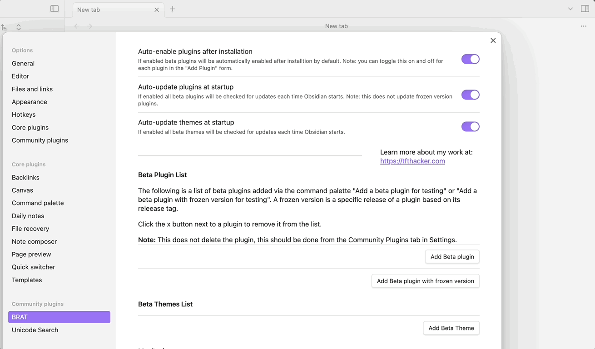
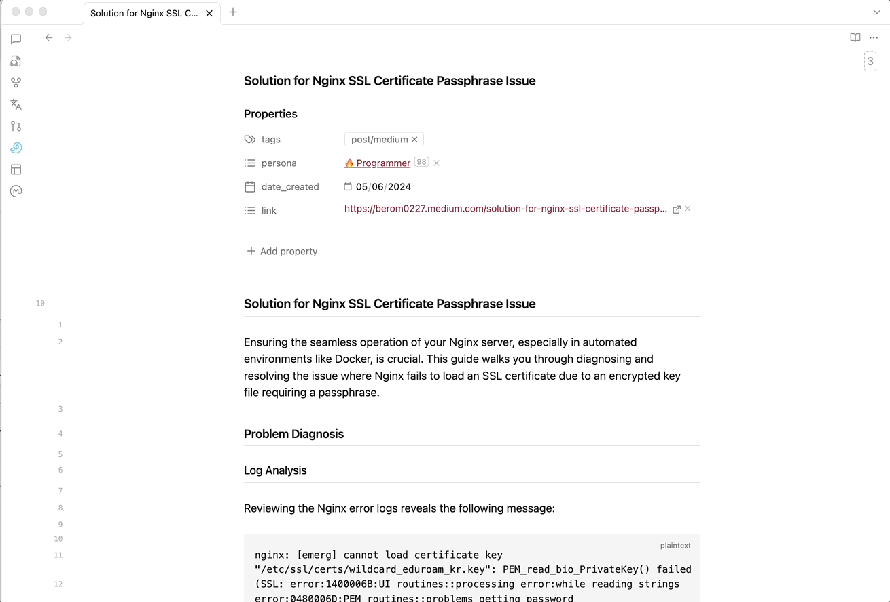

# Metadata Auto Classifier

Metadata Auto Classifier is an innovative Obsidian plugin that harnesses the power of AI to revolutionize your note-taking experience. By automatically generating and classifying metadata for your notes, this plugin streamlines your workflow and enhances the organization of your knowledge base.

## 🚀 Features

### 🧠 AI-Powered Metadata Generation
- **Intelligent Tag Suggestions**: Analyzes your note content and suggests relevant tags, helping you categorize information effortlessly.
- **Custom Frontmatter Classification**: Automatically populates user-defined frontmatter fields based on note content, creating a rich, structured dataset within your vault.

### 🔧 Flexible Configuration
- **Multiple AI Providers**: Currently supports OpenAI's GPT models, with the potential to integrate other AI services in the future.
- **Customizable Settings**: Tailor the plugin to your needs by adjusting the number of tags or frontmatter options generated.

### 🔄 Seamless Integration
- **Works with Existing Metadata**: Respects and enhances your current tagging system and frontmatter structure.
- **Non-Destructive Updates**: Adds new metadata without overwriting existing information, preserving your manual classifications.

### 🎛️ User-Friendly Interface
- **Easy-to-Use Commands**: Access the plugin's features through simple commands in Obsidian's command palette.
- **Intuitive Settings Panel**: Configure API keys, adjust classification parameters, and manage frontmatter fields with ease.

## 🌟 Potential Use Cases
1. **Research Organization**: Automatically categorize research notes, making it easier to find related information across projects.
2. **Content Creation**: Generate tags for blog posts or articles, improving SEO and content discoverability.
3. **Personal Knowledge Management**: Enhance your Zettelkasten or other note-taking systems with AI-suggested connections and categories.
4. **Project Management**: Automatically classify project notes by status, priority, or team member.
5. **Learning and Study**: Organize study notes by subject, topic, or difficulty level without manual input.
6. **Idea Generation**: Use AI-suggested tags to spark new connections between seemingly unrelated notes.

## 🛠️ Installation
> **Note**: The plugin is on process of being reviewed for the Obsidian Community Plugins. Once the review is complete, we will update this README with the official installation instructions. In the meantime, you can install the beta version using the instructions below.
1. Open Obsidian and navigate to Settings > Community Plugins.
2. Disable Safe Mode if it's currently enabled.
3. Click on "Browse" and search for "Metadata Auto Classifier".
4. Click "Install", then "Enable" to activate the plugin.

### 📦 Manual Installation (Beta)
To install the beta version of the Metadata Auto Classifier plugin using the Beta Reviewers Auto-update Tool (BRAT):

1. Install BRAT from the Obsidian Community Plugins browser
2. In the BRAT settings, click on "Add Beta plugin".
3. Enter the following GitHub repository URL: 
   ```
   https://github.com/beromkoh/obsidian-metadata-auto-classifier
   ```
4. Click "Add Plugin" to install the beta version.
   


## 🖱️ Usage



1. Open a note you want to classify.
2. Use the command palette (Cmd/Ctrl + P) and search for:
   - "Fetch tags using current provider" to generate tags.
   - "Fetch all frontmatter using current provider" to populate custom frontmatter fields.
   - Also, you can fetch single frontmatter field using command palette.
3. Review and edit the AI-generated suggestions as needed.

## 📋 Current Features
- **OpenAI GPT Integration**: Leverages OpenAI's GPT models for metadata generation.
- **Tag Suggestions**: Automatically suggests tags based on note content.
- **Frontmatter Classification**: Populates user-defined frontmatter fields.
- **Customizable Settings**: Adjust the number of tags and frontmatter options.
- **Non-Destructive Updates**: Adds metadata without overwriting existing data.
- **User-Friendly Commands**: Easy access through Obsidian's command palette.
- **Settings Panel**: Configure API keys and classification parameters.

## 📝 To-Do List
- **Support for Additional AI Providers**: Integrate other AI services beyond OpenAI.
- **Enhanced Frontmatter Options**: More customization options for frontmatter fields.
- **Improved Tagging Algorithms**: Refine the AI algorithms for better tag suggestions.
- **Batch Processing**: Ability to classify multiple notes at once.
- **User Feedback Integration**: Allow users to provide feedback on AI suggestions to improve accuracy.
- **Localization**: Support for multiple languages in the plugin interface.
- **Advanced Filtering**: More advanced options for filtering and sorting notes based on metadata.

## 🤝 Contributing
We welcome contributions to enhance the Metadata Auto Classifier! Whether it's bug fixes, feature additions, or documentation improvements, your input is valuable. Please feel free to submit a Pull Request or open an issue for discussion.

## 🆘 Support
If you encounter any issues or have suggestions for improvements, please don't hesitate to open an issue on our GitHub repository. We're committed to making this plugin as useful and robust as possible for the Obsidian community.

## 📜 License
This project is licensed under the [MIT License](LICENSE).
